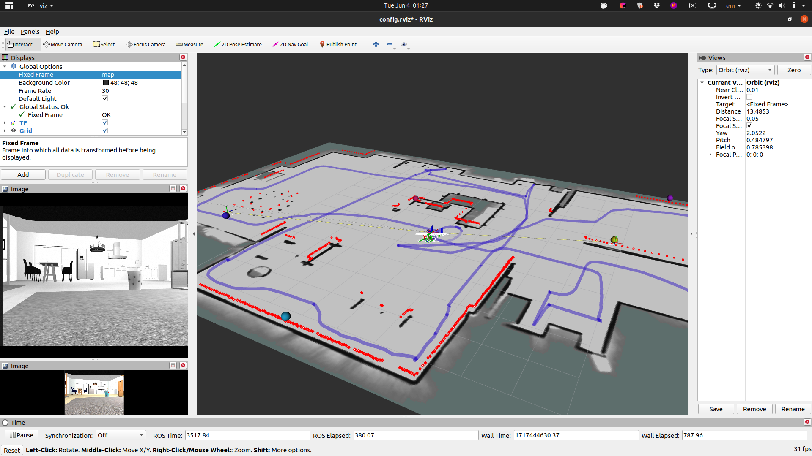

## Instructions for AGV SIM TASK 

### Catkin Workspace
Create a catkin workspace through the following commands
```
mkdir –p ~/catkin_ws/src
cd ~/catkin_ws/src
catkin_init_workspace
cd ~/catkin_ws/
catkin_make
source ~/catkin_ws/devel/setup.bash
echo "source ~/catkin_ws/devel/setup.bash" >> ~/.bashrc
```
To ensure your workspace is properly set up, check for the ROS_PACKAGE_PATH using the following command. You must see the current directory similar to 
```
echo $ROS_PACKAGE_PATH
```
> /home/<username>/catkin_ws/src:/opt/ros/noetic/share:/opt/ros/noetic/stacks
### Cloning the current repository
All the executables and folders are to be placed in src/ and catkin_make every time you modify the src/ folder.
Hence, navigate to the src/ folder and clone the required repositories & dependencies as follows:
```
cd ~/catkin_ws/src
git clone https://github.com/tharun-selvam/sim_task_agv.git
```
### Dependencies
```
git clone https://github.com/nilseuropa/realsense_ros_gazebo.git
```
```
git clone https://github.com/issaiass/realsense2_description.git
```
```
sudo apt-get install ros-noetic-teleop-twist-keyboard ros-noetic-urdf ros-noetic-xacro ros-noetic-rqt-image-view  ros-noetic-robot-state-publisher ros-noetic-joint-state-publisher-gui
```
Before moving on to launching the setup, navigate to the root of the workspace and make the workspace
```
cd ~/catkin_ws
catkin_make
```
Use the commands in the following section to launch the bot.
### Running Gazebo Simulations
In terminal 1,
``` 
roslaunch tortoisebotpromax_gazebo tortoisebotpromax_playground.launch
```
### Running RViz Visualization
Open another terminal (terminal 2)
``` 
roslaunch tortoisebotpromax_description display.launch
```
You may change the Rviz configuration by adding topics for generating maps, visualization purposes, etc.,
### Teleoperation of the bot
In terminal 3
```
rosrun teleop_twist_keyboard teleop_twist_keyboard.py
```
and follow the instructions in the terminal for teleoperation. 
Note: Use keyboard commands while being in the terminal for publishing the control commands.  

You may subscribe to the needed sensor feedback and publish your control commands through corresponding rostopics via subscribers and publishers.
To list down all rostopics, use
```
rostopic list
```
# Getting the TortoisebotProMax Running
Here's a quick overview of the launch files that need to be initiated to get the robot running in autonomous/manual mode:
1. **bringup.launch**: Initiates the necessary hardware nodes and state publishers on the robot.
 Launching this script will get you:
- Teleop control
- Lidar visualization
- Wheel odometry
- Imu data
- State publishers
- Internal PID control
Here's the command line:
```
roslaunch tortoisebotpromax_firmware bringup.launch pid:=true
```
(Note: You can turn PID off simply by changing the argument to pid:=false)

2. **server_bringup.launch**: Initiates necessary localization tools for autonomous navigation
Launching this script will get you:
- Cartographer Node Initialization
- Laser-based odometry
Here's the command line:
```
roslaunch tortoisebotpromax_firmware server_bringup.launch
```
3. **tortoisebotpromax_navigation.launch**: Initiates the autonomous navigation for exploration as well as localization modes
Launching this script will get you:
- Cartographer Based Mapping/Localization
- Move base navigation tools
Here's the command line:
```
roslaunch tortoisebotpromax_navigation tortoisebotpromax_navigation.launch exploration:=true
```
Note: 
- exploration:true enables the robot to move in SLAM mode. It can autonomously navigate in the environment while creating the map for the same.
- exploration:=false mode sets the robot in localization mode. It spawns itself in the map you provide and navigates within the space.
- When in localization mode, you can provide the map file by:
```
roslaunch tortoisebotpromax_navigation tortoisebotpromax_navigation.launch exploration:=false map_file:/"location of your map file"
```

## Task
After launching the above setup, 
1. You will need to visualize the lidar point cloud in Rviz. (Take a screenshot of Rviz as proof) 
2. Teleoperate, scan the AruCo markers and store the corresponding waypoint information and robot's pose.
3. Generate an occupancy grid-based map ( You may use established algorithms by mentioning) while teleoperating with the bot.
4. Finally, drive the robot autonomously through a sequence of waypoints stored.


### General Useful references
1. ROS Tutorials -[http://wiki.ros.org/ROS/Tutorials](http://wiki.ros.org/ROS/Tutorials)
2. Rviz User guide -[http://wiki.ros.org/rviz/UserGuide](http://wiki.ros.org/rviz/UserGuide)

### Some useful tips
- Try reading on launch files, ros params, urdf files to get an idea of the code base
- Learning about urdf files also exposes you to learn about Gazebo and Rviz which really helps
- As you might have realised by now, there aren't many video tutorials on ROS. So you have to learn by going through the documentation
- Google WHATEVER error you face and go through every link and comment on stackoverflow 

# Discussions related to the Solution

## Installing required packages for the task

```bash
cd ~/Workspaces/tortoisebotpromax_agv/

# Cloning ros_aruco_opencv and aruco_opencv_to_cartographer_landmark for installing from source
git clone -b noetic https://github.com/fictionlab/ros_aruco_opencv src/ros_aruco_opencv
git clone https://github.com/real-Sandip-Das/aruco_opencv_to_cartographer_landmark src/aruco_opencv_to_cartographer_landmark

# Other dependencies for camera
sudo apt-get install ros-noetic-realsense2-camera ros-noetic-cv-bridge ros-noetic-image-transport ros-noetic-opencv-apps

# For building Google Cartographer
sudo apt install lua5.3 liblua5.3-dev

# Building Google Cartographer
sudo apt-get update
sudo apt-get install google-mock libgmock-dev
sudo apt-get install -y python3-wstool python3-rosdep ninja-build stow
wstool init src
wstool merge -t src https://raw.githubusercontent.com/cartographer-project/cartographer_ros/master/cartographer_ros.rosinstall
wstool update -t src
src/cartographer/scripts/install_abseil.sh
rosdep update
rosdep install --from-paths src --ignore-src --rosdistro=${ROS_DISTRO} -y
rm -rf abseil-cpp
catkin config --install --cmake-args -G Ninja
catkin clean && catkin build # also builds ros_aruco_opencv and aruco_opencv_to_cartographer_landmark
```

## Explanation for the SLAM launch file `tortoisebotpromax_slam/launch/custom_agv_task.launch`

```xml
    <!-- Start Google Cartographer node with custom configuration file-->
    <node name="cartographer_node" pkg="cartographer_ros" type="cartographer_node" args=" 
        -configuration_directory $(find tortoisebotpromax_firmware)/config 
        -configuration_basename lidar.lua" 
          output="screen">
    </node>
```

This part was taken from `server_bringup.launch`, since `cartographer_node` is one of the two required Nodes launched for Google Cartographer SLAM

```xml
    <node pkg="image_proc" type="image_proc" name="image_proc" ns="/camera/color" />
```

Running `image_proc` node to rectify image
It is translated from the following equivalent `rosrun` command:

```bash
ROS_NAMESPACE=/camera/color rosrun image_proc image_proc
```

For Rectifying the Raw camera image and republishing it to another topic

```xml
    <!-- Run the nodelet manager -->
    <node pkg="nodelet" type="nodelet" name="aruco_tracker_nodelet_manager" args="manager" output="screen"/>

    <!-- Load the ArucoTracker nodelet -->
    <node pkg="nodelet" type="nodelet" name="aruco_tracker" args="load aruco_opencv/ArucoTracker aruco_tracker_nodelet_manager" output="screen">
        <param name="cam_base_topic" value="/camera/color/image_rect"/>
        <param name="marker_size" value="0.4"/>
        <param name="image_is_rectified" value="true"/>
    </node>
```

For utilizing the package `aruco_opencv` written using OpenCV's C++ API, that is supposed to detect ArUco markers visible through the camera and estimate their poses.
Equivalent bash command:

```bash
rosrun nodelet nodelet standalone aruco_opencv/ArucoTracker _cam_base_topic:=camera/color/image_rect _marker_size:=0.2 _image_is_rectified:=true
```

I found out about an existing bug in this package which was initially causing it to not work correctly, \
so I made a [pull request](https://github.com/fictionlab/ros_aruco_opencv/pull/45) resolving the issue. \
Thus, I recommended installing the latest version of this package from source.

```xml
    <!-- Convert pose estimations of ArUco markers to Landmarks for Google Cartographer -->
    <include file="$(find aruco_opencv_to_cartographer_landmark)/launch/demo.launch"/>
```

This corresponds to the custom node that I wrote in C++ for translating and forwarding the ArUco detections from the previously discussed Nodelet to the `/landmark` topic for being used by Google Cartographer

## Recording a ROS Bag for SLAM

Launching:

```bash
roslaunch tortoisebotpromax_gazebo tortoisebotpromax_playground.launch
```

It is recommended to decrease the `real time update rate`, close the Gazebo window and continue with rviz visualizations
The reason for the aforementioned being that simulating the Realsense RGBD Camera can be computationally heavy on certain machines, \
resulting in decreased frequency of the `/camera` topic whereas, Google Cartographer SLAM requires `/camera` and `/scan` to be published \
at a frequency not too different from each other (for SLAM involving landmarks)

Teleoperating:

```bash
rosrun teleop_twist_keyboard teleop_twist_keyboard.py 
```

Recording:

```bash
rosbag record /tf /tf_static /scan /cmd_vel /camera/color/camera_info /camera/color/image_raw /camera/depth/camera_info /camera/depth/color/points /camera/depth/image_raw /camera/infra1/camera_info /camera/infra1/image_raw /camera/infra2/camera_info /camera/infra2/image_raw
```

(Now assume that the Bag file has been saved in/renamed to `src/SLAMbag2original.bag`)

I've been recording this many topics because I'm currently experimenting with 3D Mapping utilizing the robot's Realsense RGBD camera
For the project's current state, this will suffice:

```bash
rosbag record /tf /tf_static /scan /cmd_vel /camera/color/camera_info /camera/color/image_raw
```

In case the Bag file has been recorded using the former `rosbag record` command, this can be used to get a Bag file as if it's been recorded with the latter:

```bash
rosbag filter src/SLAMbag2original.bag src/SLAMbag2.bag "topic in ['/tf', '/tf_static', '/scan', '/cmd_vel', '/camera/color/camera_info', '/camera/color/image_raw']"
```

Compressing the bag file using **LZ4** compression:

```bash
rosbag compress --lz4 ./*.bag
```

## Explanation for the Navigation Launch file `custom_agv_task.launch`

```xml
    <include file="$(find tortoisebotpromax_navigation)/launch/amcl.launch">
        <arg name="scan_topic"     value="scan"/>
        <arg name="base_frame"     value="base_link"/>
        <arg name="initial_pose_x" value="0.0"/>
        <arg name="initial_pose_y" value="0.0"/>
        <arg name="initial_pose_a" value="0.0"/>
    </include>
```

Uses AMCL(Advanced Monte Carlo Localization) to publish `odom` to `map` transform required for Navigation

```xml
    <include file="$(find tortoisebotpromax_navigation)/launch/tortoisebotpromax_sim_navigation.launch">
        <arg name="map_file" value="custom_agv_task"/>
        <arg name="move_forward_only" value="false"/>
        <arg name="exploration" value="false"/>
    </include>
```

Apart from Localization, this sets up the rest of the Navigation stack(`move_base` and `map_server`) which includes:

- `map_server` for serving the Occupancy grid generated utilizing SLAM
- A Local Planner(`dwa_local_planner/DWAPlannerROS` in this case) and a Global Planner(Dijkstra's Algorithm, internally) for the robot to plan paths to provided waypoints and execute them by sending commands to `cmd_vel`

It also sets up the RViz visualization

```xml
    <include file="$(find waypoints_server)/launch/loader.launch" />
```

For reading and sending waypoints from disk to the Navigation stack

### Explanation for (most of) the parameter adjustments

# How to run the solution

## SLAM

Playing the ROS Bag:

```bash
rosbag play --clock --rate=0.7 src/SLAMbag2.bag
```

Starting SLAM:

```bash
roslaunch tortoisebotpromax_slam custom_agv_task.launch
```

Saving the Generated Map:

```bash
roslaunch tortoisebotpromax_slam map_saver.launch
```



- The spherical markers in the Visualization represents the detected positions of the markers in the map (since their detections were integrated during SLAM as landmark data)
- The detected trajectory of the robot in the generated map is shown in Blue
- The LiDAR Point cloud is also visualized here in Red

The last launch file also runs custom nodes written by me in C++, that extracts the closest(Euclidean distance) poses to each ArUco marker in the trajectory and saves them to a file named `saved_example.dat` for being used as waypoints

## Navigation

It is required to start the simulation first:

```bash
roslaunch tortoisebotpromax_gazebo tortoisebotpromax_playground.launch
```

Running this launch file will start running the navigation task:

```bash
roslaunch tortoisebotpromax_navigation custom_agv_task.launch
```

Basically driving the robots through the stored waypoints
